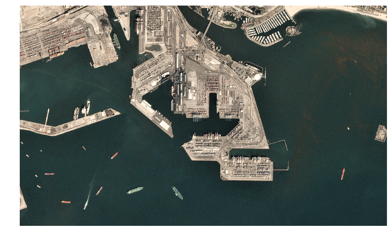
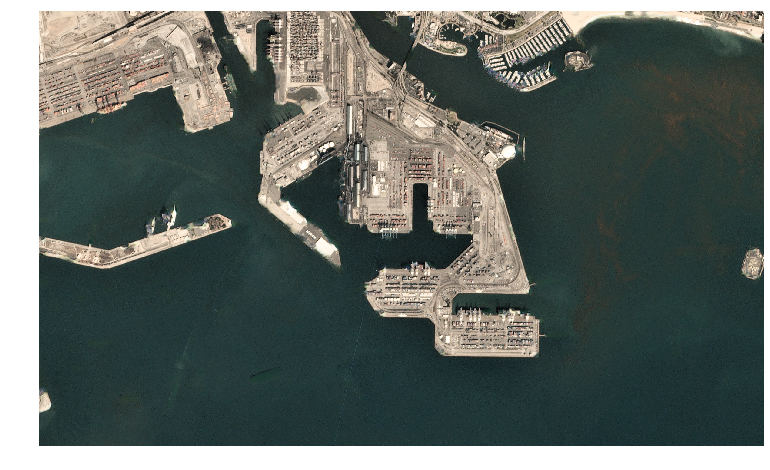
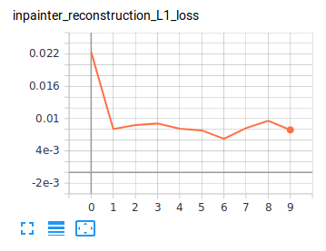
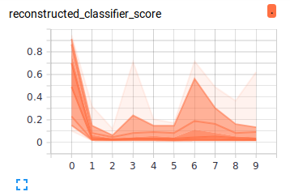
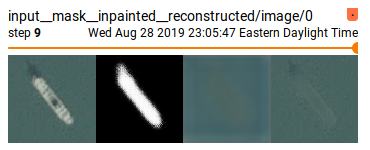

# decepticon

teaching machines to lie


* Free software: MIT license

This repository contains a tensorflow/keras implementation of the elegant object removal model described in [Adversarial Scene Editing: Automatic Object Removal from Weak Supervision](https://arxiv.org/abs/1806.01911) by Shetty, Fritz, and Schiele.

We've been testing using Python 3.6 and TensorFlow 1.14.

## Example

On the [Kaggle "Ships in Satellite Imagery"](https://www.kaggle.com/rhammell/ships-in-satellite-imagery) dataset:

### Input



### Output



## Usage

### Data

So far we've only tested single-class object removal. You'll need two lists of filepaths- one to image patches containing objects and one without. All patches should be prepared to the same size.

### Models

Shetty *et al*'s model has several components; `decepticon` expects a `keras` Model object for each. You can reproduce the models from the paper or substitute your own so long as they have the correct inputs and outputs:

| **Component** | **Description** | **Input Shape** | **Output Shape** | **Code** |
| ---- | ---- | ---- | ---- | ---- |
| **mask generator** | fully-convolutional network that generates a mask from an input image | `(None, None, None, 3)` | `(None, None, None, 1)` | `decepticon.build_mask_generator()` |
| **classifier** | standard convolutional classifier that maps an image to a probability over categories| `(None, None, None, 3)` | `(None, num_classes+1)` | `decepticon.build_classifier()` |
| **inpainter** | fully-convolutional network that inputs a partially-masked image (with a 4th channel containing the mask) and attempts to generate the original unmasked version (like a  denoising autoencoder or [context encoder](https://arxiv.org/abs/1604.07379))| `(None, None, None, 4)` | `(None, None, None, 3)` | `decepticon.build_inpainter()` |
| **discriminator** | fully-convolutional network that inputs an image and makes a pixel-wise assessment about whether the image is real or fake| `(None, None, None, 3)` | `(None, None, None, 1)` | `decepticon.build_discriminator()` |
| **mask discriminator** | convolutional classifier that tries to classify mask generator outputs as real or fake   | (None, None, None, 1) | (None, 1) | `decepticon.build_mask_discriminator()` |

If you're training on a consumer GPU you may run into memory limitations using the models from the paper and a reasonable batch size- if you pass the keyword argument `downsample=n` to any of the above functions, the number of filters in every hidden convolutional layer will be reduced by a factor of `n`.

### Training

#### Initialize models

Before starting, initialize your own custom models or the ones from the paper:

```{python}
classifier = decepticon.build_classifier()
inpainter = decepticon.build_inpainter()
maskgen = decepticon.build_mask_generator()
disc = decepticon.build_discriminator()
```

#### Set up `Trainer` object

The `decepticon.Trainer` class has convenience code for all the training steps- instantiate it with the initialized models, lists of paths to positive and negative image patches, hyperparameters, and a path to a log directory:

```{python}
trainer = decepticon.Trainer(maskgen, classifier,
                             inpainter, disc,
                             posfiles, negfiles,
                             lr=1e-5, disc_weight=10,
                             logdir="/path/to/log/directory/",
                             batch_size=32,
                             exponential_loss_weight=1
                             )
```

#### Classifier

The image classifier is trained on randomly-masked images. You can use `decepticon.classifier_training_dataset()` to build a randomly-masked `tf.data.Dataset` object that you can use with the standard Keras `Model.fit()` API, or use `trainer.pretrain_classifier()`:

```{python}
trainer.pretrain_classifier(epochs=10)
```

### Training

Finally, run the alternating-epoch (mask generator vs inpainter) and alternating-batch (inpainter and discriminator) training:

```{python}
trainer.fit(10)
```

You can also run the different training phases independently with `trainer.fit_mask_generator()` and `trainer.fit_inpainter()`.


### Monitoring in TensorBoard

If a log directory is specified, models and TensorBoard logs will be saved there.

All the terms in the loss function will be recorded as scalars:



Histograms will record classification and discriminator probabilities on reconstructed examples, to visualize how well the system is fooling them:



Images will record examples of raw images, mask generator and inpainter outputs for them, and the reconstructed image:




### Inference

The end-to-end object removal network is stored as a Keras model in `trainer.full_model`; run inference using the normal `predict` interface.

## Credits

This package was created with [Cookiecutter](https://github.com/audreyr/cookiecutter) and the [audreyr/cookiecutter-pypackage](https://github.com/audreyr/cookiecutter-pypackage) project template.
